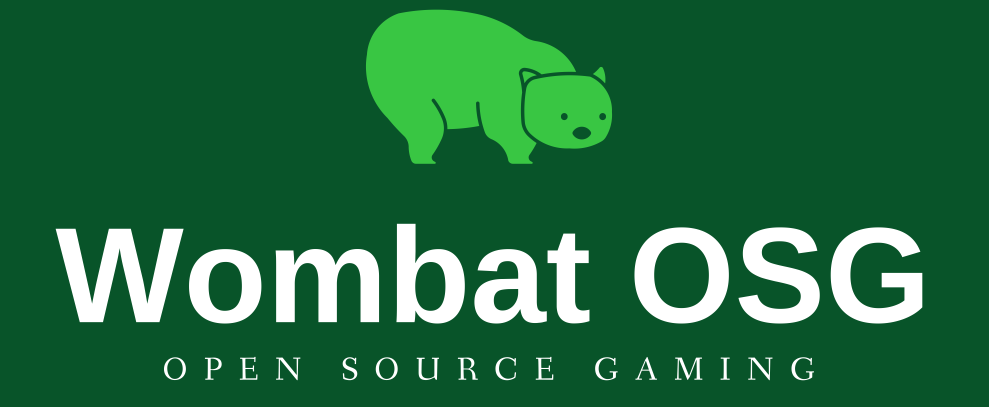

# What The Hex?

This is a reimplementation of What The Hex? in C#, using the [Godot Game Engine](https://godotengine.org).

## Supported Platforms

Tier 1 (Should Work Well):

* Android/Chrome OS/Fire OS (ARM)
* GNU/Linux (amd64)
* Windows (x86)

Tier 2 (Will Probably Work Well):

* macOS (Can't test this at the moment, but no reason to believe it will be an issue)

Tier 3 (Works With Significant Issues)

* Desktop HTML5 (Currently works on Firefox and Edge. It works on Brave, but only with Shields Down. The alignment is currently all wrong.)

Tier 4 (Might work if compiled from source, but no promises)

* iOS

Tier 5 (Might work in the future, but I don't currently expect it to)

* Mobile HTML5 (The resolution is all wrong and touch events don't work. Will require a lot of work to get this up to snuff)
* Xbox One and Xbox Series X/S: Currently UWP targets do not support Mono. If this is fixed in the future I'm definitely interested. The relevant GitHub Issue is https://github.com/godotengine/godot/issues/20271 . For some reason the Edge browser here doesn't work either - maybe it will after the Chromium-based Edge is made available to all Xbox users.
* Raspberry Pi and other non-Android ARM devices: I don't want to compile my own build templates, so this is unsupported until they add one by default.

For mobile devices, a tablet is recommended, as the screen needs to be able to display at 1024 * 600 resolution smoothly

## Controls

Joystick (Supported on all platforms):

* D-Pad: Change currently selected hexagon
* Left shoulder buttons/triggers (L, L1, L2, LB, ZL, etc.): Rotate currently selected hexagon counterclockwise
* Right shoulder buttons/triggers (R, R1, R2, RB, ZR, etc.): Rotate currently selected hexagon clockwise

Support for using analog sticks to change the currently selected hexagon is planneed.

Mouse (Supported on desktop and web only):

* Left Click: Rotate hexagon under mouse cursor counterclockwise
* Right Click: Rotate hexagon under mouse cursor clockwise

Touch (Supported on Android only, _might_ work on desktop platforms with a touch screen):

* Tap on any hexagon: Select
* Specific touch buttons in the top-right handle rotation of the current hexagon

Support for a touch-specific control scheme is planned.

## Reporting Bugs

To report a bug, please send an email to Bob "Wombat" Hogg &lt;wombat@rwhogg.site&gt;.

## Created By

A Division Of

## Copyright

See the files [COPYING](COPYING) and [LICENSE.txt](LICENSE.txt)

## Third-Party Licenses

See the file [THIRD-PARTY-LICENSES.txt](project/THIRD-PARTY-LICENSES.txt)

## Acknowledgements

What The Hex? is built on the Godot Engine and on [Mono](https://www.mono-project.com/).

Special thanks to www.kenney.nl and to the [Superpowers app](http://superpowers-html5.com/) team for providing a number of the assets.
