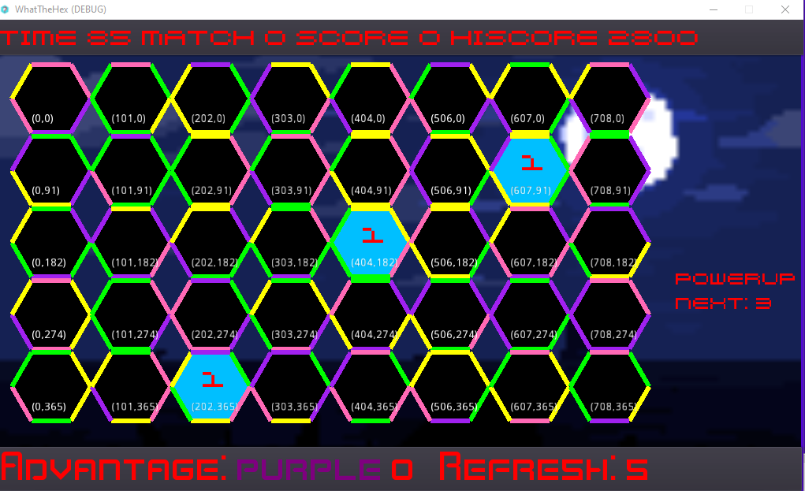

This is What The Hex?, a geometric puzzle game made in C#, using the [Godot Game Engine](https://godotengine.org).

_The pursuit of true hexcellence requires that you clear your mind and become one with the geometry of the universe..._

# Rules

* You begin with an 8 x 5 grid of hexagons

* Each hexagon has one of 4 colors on each edge

* You can rotate any given hexagon 60 degrees counterclockwise with a left click, 60 degrees clockwise with a right click

* You start with 100 seconds on the clock

* If a rhombus with 4 hexagons bordering it has all 4 edges the same color, you get a match

* Most matches are worth 100 points, but each match you make with the current advantage color gives you 300 instead

* Every 10 seconds, random hexagons are regenerated

* Hexagons are internally black by default but turn blue when they are selected for replacement
* The number of hexagons refreshed per cycle increases by 1 every 3 refresh cycles

* You win if you make 20 matches

# Controls

Joystick (Supported on all platforms):

* D-Pad: Change currently selected hexagon
* Left shoulder buttons/triggers (L, L1, L2, LB, ZL, etc.) OR B (Switch), A (Xbox), X (PlayStation): Rotate currently selected hexagon counterclockwise
* Right shoulder buttons/triggers (R, R1, R2, RB, ZR, etc.) OR A (Switch), B (Xbox), Circle (PlayStation): Rotate currently selected hexagon clockwise
* Y (Switch), X (Xbox), and Square (PlayStation): Activate powerup

Mouse (Supported on desktop and web only):

* Left Click: Rotate hexagon under mouse cursor counterclockwise
* Right Click: Rotate hexagon under mouse cursor clockwise

Keyboard (Supported on desktop only, might work on web):

* Arrow Keys: Change currently selected hexagon
* Space Bar: Rotate currently selected hexagon clockwise

Touch (Supported on Android only, _might_ work on desktop platforms with a touch screen):

* Tap on any hexagon: Select
* Specific touch buttons in the top-right handle rotation of the current hexagon

# Supported Platforms

Tier 1 (Should Work Well):

* Android/Chrome OS/Fire OS (ARM)
* GNU/Linux (amd64)
* HTML5/Web Browsers
    * Note that mobile browsers on iOS do not support the screen orientation API, so you may have trouble fitting that one onto the screen.
* Windows (x86)

Tier 2 (Will Probably Work Well):

* macOS (Can't test this at the moment, but no reason to believe it will be an issue)

Tier 3 (Might work if compiled from source, but no promises)

* iOS (I lack the hardware to compile for this)
* Raspberry Pi and other non-Android ARM devices: I don't want to compile my own build templates, so this is unsupported until they add one by default.

Tier 4 (Might work in the future, but I don't currently expect it to)

* Xbox One and Xbox Series X/S: Currently UWP targets do not support Mono. If this is fixed in the future I'm definitely interested. The relevant GitHub Issue is https://github.com/godotengine/godot/issues/20271

# Reporting Bugs

To report a bug, please send an email to Bob "Wombat" Hogg &lt;wombat@rwhogg.site&gt;.

# Created By

A Division Of

# Copyright

See the file [LICENSE.txt](LICENSE.txt)

Exception: If you are redistributing modified versions of What The Hex? in binary form, please remove
the Boarish Entertainment splash screen. See [NOTICE](NOTICE) for details.

# Third-Party Licenses

See the file [THIRD-PARTY-LICENSES.txt](project/THIRD-PARTY-LICENSES.txt)

# Acknowledgements

What The Hex? is built on the Godot Engine and on [Mono](https://www.mono-project.com/).

Special thanks to www.kenney.nl and to the [Superpowers app](http://superpowers-html5.com/) team for providing a number of the assets.
